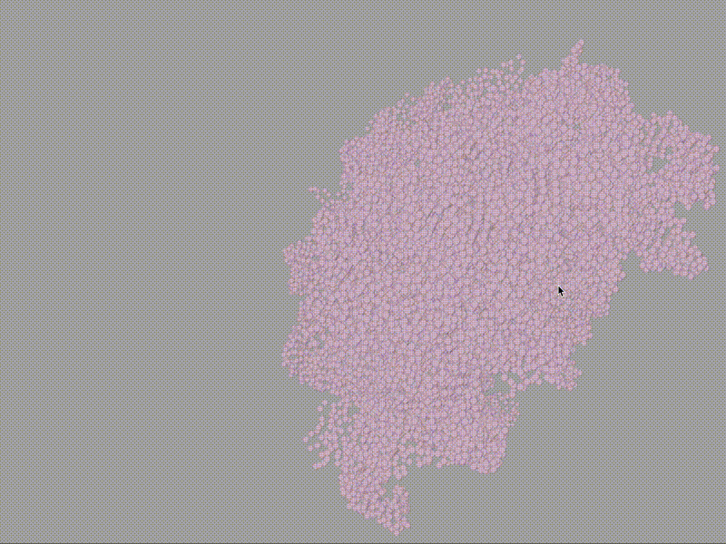
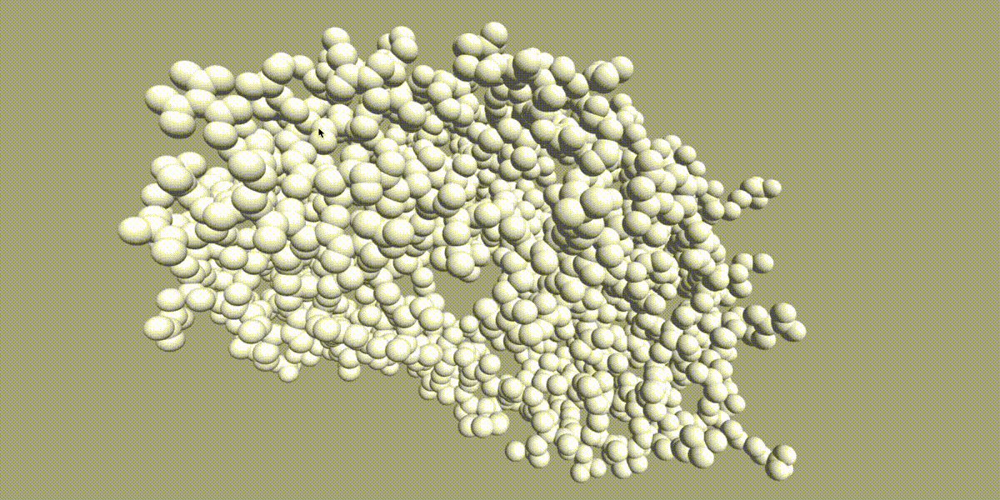

# tiny-molecule
A small, developer-friendly 3D molecule viewer for the modern web.

See a live exmaple at [https://justinmc.github.io/tiny-molecule/](https://justinmc.github.io/tiny-molecule/).




## Getting Started

`npm install --save tiny-molecule`

```
import tinyMolecule from 'tiny-molecule';
import pdbString from 'raw-loader!./3aid.pdb';

tinyMolecule(
  window.document.body, // the DOM element to render into
  dataString, // string of pdb or mmcif data
  {
    type: 'PDB', // or 'MMCIF' depending on what filetype dataString is
    representation: 'particle', // or 'sphere'
  }
);
```

## API
`tinyMolecule` exports a single function that takes a DOM element, a data string, and an options object.  The data string can be either the contents of a PDB or MMCIF file.  It will synchronously render a canvas into the given DOM element visualizing the given molecule.

See the example folder for a full working example that uses RCSB's API to fetch molecules by PDBID.  You can run it for yourself with `npm run example` (after an `npm install`).

### options

#### type {PDB|MMCIF}
Indicates the type of data that is being input into tinyMolecule.  Currently PDB and MMCIF files are supported.

#### representation {particle|sphere}
The fastest option is `particle`, which draws a 2d particle that looks like a sphere for each atom.  `sphere` draws a fully lit 3D sphere for each atom, but is slow for large structures.

## License
MIT.  See LICENSE file.
